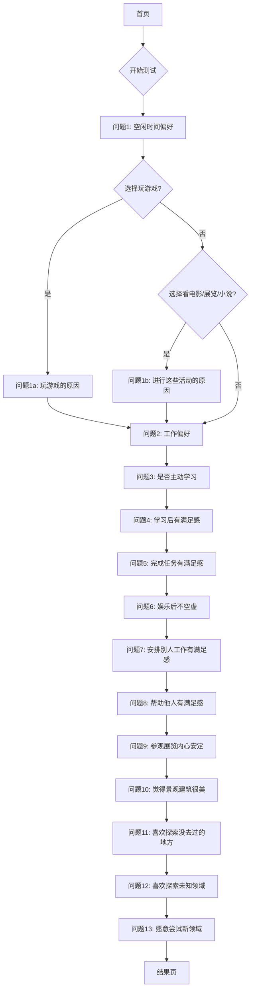

## 1. Product Overview
驱动型人格测试网站 - 帮助用户了解自己的积极情感来源，探索内在动力类型。
- 通过一系列问答测试用户的核心驱动力，包括学习、成就、娱乐、权力、社交、利他、审美、探索、稳定九种类型
- 提供神秘风格的交互体验，让用户在探索中发现自我

## 2. Core Features

### 2.1 User Roles
| Role | Registration Method | Core Permissions |
|------|---------------------|------------------|
| User | None (anonymous) | Access test, view results |

### 2.2 Feature Module
1. **首页**：测试介绍、开始测试入口
2. **测试页**：条件分支问答流程、进度展示
3. **结果页**：驱动类型分析、详细报告

### 2.3 Page Details
| Page Name | Module Name | Feature description |
|-----------|-------------|---------------------|
| 首页 | Hero区域 | 神秘风格的测试介绍、开始测试按钮 |
| 测试页 | 问题展示 | 根据前一题答案动态显示下一题（条件分支） |
| 测试页 | 进度条 | 显示当前测试进度 |
| 结果页 | 结果展示 | 雷达图展示各驱动类型得分、类型分析 |

## 3. Core Process

用户流程：首页 → 开始测试 → 回答问题（条件分支）→ 查看结果

## 4. User Interface Design

### 4.1 Design Style
- **主色调**：深紫色(#1a0a2e)、深蓝色(#16213e)、金色点缀(#f4d03f)
- **按钮风格**：圆角、渐变、发光效果
- **字体**：衬线字体（神秘氛围）、无衬线字体（正文）
- **布局**：居中、沉浸式、卡片式
- **动画**：淡入淡出、星空粒子背景、问题切换动画

### 4.2 Page Design Overview
| Page Name | Module Name | UI Elements |
|-----------|-------------|-------------|
| 首页 | Hero区域 | 星空背景、标题渐变、神秘图标、开始按钮 |
| 测试页 | 问题卡片 | 深色背景、金色边框、选项悬停发光 |
| 测试页 | 进度条 | 渐变填充、百分比显示 |
| 结果页 | 雷达图 | 动态绘制、颜色区分 |
| 结果页 | 分析卡片 | 卡片布局、类型描述 |

### 4.3 Responsiveness
- 桌面优先设计，支持移动端自适应
- 触控优化的按钮尺寸

## 5. Question Logic

### 5.1 驱动类型对应分数
| 驱动类型 | 代码 | 分数来源 |
|----------|------|----------|
| 学习驱动型 | 1 | 问题1-C、问题1b-B、问题2-B、问题3-是、问题4-是 |
| 成就驱动型 | 2 | 问题1-F、问题1a-B、问题1a-C、问题2-C、问题5-是 |
| 娱乐驱动型 | 3 | 问题1-A、问题1-B、问题2-A、问题6-是 |
| 权力驱动型 | 4 | 问题1a-F、问题2-D、问题7-是 |
| 社交驱动型 | 5 | 问题1-E、问题1a-D、问题2-F、问题8-是 |
| 利他驱动型 | 6 | 问题2-E、问题9-是 |
| 审美驱动型 | 7 | 问题1-G、问题1a-E、问题1b-A、问题10-是、问题11-是 |
| 探索驱动型 | 8 | 问题1-D、问题1a-A、问题2-B、问题2-C、问题12-是、问题13-是 |
| 稳定驱动型 | 9 | 问题2-A、问题2-G、问题12-否、问题13-否 |

### 5.2 问题列表
**问题1**：在完全自己掌握的时间中，你更愿意
- A. 玩游戏 (3)
- B. 刷视频 (3)
- C. 学习知识 (1)
- D. 外出游玩 (8)
- E. 和朋友小聚 (5)
- F. 做一些事情，例如打扫房间 (2)
- G. 看电影，展览，小说等

**问题1a**（条件：问题1选择A）：玩游戏的原因是为了
- A. 探索未知，收集癖 (8)
- B. 通过技术或者智慧赢得游戏 (2)
- C. 通过日积月累的运营获得成就感 (9)
- D. 在游戏的过程中和他人聊天 (5)
- E. 欣赏景色，人物建模，战斗特效，游戏玩法，剧情 (7)
- F. 喜欢排兵布阵，决策选择 (4)

**问题1b**（条件：问题1选择G）：进行这些活动是为了
- A. 欣赏作品 (7)
- B. 从中学习 (1)

**问题2**：如果你以后从事工作，你更愿意从事
- A. 工资少一点但是工作也比较轻松的工作 (3,9)
- B. 需要不断学习的工作 (1,8)
- C. 创造，设计 (2,8,7)
- D. 领导层 (4)
- E. 帮助他人的工作 (6)
- F. 与他人交流沟通的工作 (5)
- G. 稳定的工作 (9)

**问题3**：在生活中你是否愿意主动学习
- 是 (1)
- 否

**问题4**：你是否会在学习之后有满足感
- 是 (1)
- 否

**问题5**：在你完成一个任务之后，你会有强烈的满足感
- 是 (2)
- 否

**问题6**：在进行娱乐之后，你不会有空虚的感觉，不会觉得自己的时间浪费了
- 是 (3)
- 否

**问题7**：在通过安排别人工作，从而达成任务之后，你会有满足感
- 是 (4)
- 否

**问题8**：如果你觉得非常疲惫，你可能更倾向于通过他人进行排解
- 是 (5)
- 否

**问题9**：你在帮助他人（或动物）或者做了一件好事之后，会有很满足的感觉
- 是 (6)
- 否

**问题10**：你在博物馆，展览中参观会觉得内心安定
- 是 (7)
- 否

**问题11**：你感觉生活中有一些景观和建筑都是很美的
- 是 (7)
- 否

**问题12**：你喜欢探索没有去过的地方
- 是 (8)
- 否 (9)

**问题13**：你喜欢探索未知的领域，比起你熟悉的领域
- 是 (8)
- 否 (9)

**问题14**：你更愿意尝试新的领域，哪怕会失败
- 是 (8)
- 否 (9)
