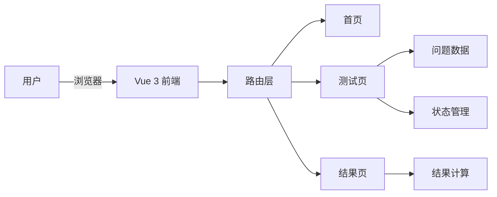
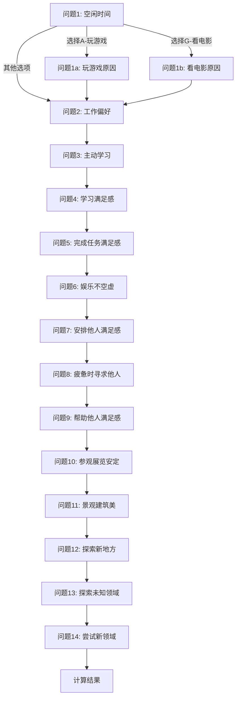

## 1. Architecture Design



## 2. Technology Description

- **Frontend**: Vue 3 + TypeScript + Tailwind CSS 3 + Vite
- **Initialization Tool**: vite-init (vue-ts template)
- **Backend**: None (纯静态网站)
- **State Management**: Vue 3 Composition API (ref/reactive)
- **Chart**: Canvas API (雷达图)

## 3. Route Definitions

| Route | Purpose |
|-------|---------|
| / | 首页 - 测试介绍 |
| /test | 测试页 - 问答流程 |
| /result | 结果页 - 测试结果展示 |

## 4. Project Structure

```
src/
├── components/
│   ├── HeroSection.vue      # 首页英雄区域
│   ├── QuestionCard.vue     # 问题卡片组件
│   ├── ProgressBar.vue      # 进度条组件
│   ├── ResultRadar.vue      # 结果雷达图
│   └── ResultCard.vue       # 结果分析卡片
├── views/
│   ├── Home.vue             # 首页
│   ├── Test.vue             # 测试页
│   └── Result.vue           # 结果页
├── data/
│   └── questions.ts         # 问题数据定义
├── utils/
│   └── scoreCalculator.ts   # 分数计算工具
├── types/
│   └── index.ts             # 类型定义
├── App.vue
├── main.ts
└── style.css
```

## 5. Data Model

### 5.1 Question Type

```typescript
interface Option {
  label: string;
  scores: number[];  // 对应的驱动类型代码数组
}

interface Question {
  id: string;
  text: string;
  options: Option[];
  condition?: {
    questionId: string;
    optionLabels: string[];
  };
}
```

### 5.2 Driver Type

```typescript
interface DriverType {
  code: number;
  name: string;
  description: string;
  color: string;
}
```

### 5.3 Result Type

```typescript
interface TestResult {
  scores: Record<number, number>;  // 各驱动类型得分
  primaryDriver: number;           // 主要驱动类型
  secondaryDriver: number;         // 次要驱动类型
}
```

## 6. Question Flow Logic



## 7. Score Calculation

1. 初始化各驱动类型得分为0
2. 根据用户选择的选项，将对应分数累加到各驱动类型
3. 每个选项可能对应多个驱动类型（如问题2-A对应3和9）
4. 计算完成后，找出得分最高的驱动类型作为主要类型
5. 第二高的作为次要类型

## 8. Styling

- 主题色：深紫色 #1a0a2e, 深蓝色 #16213e
- 强调色：金色 #f4d03f
- 背景：星空粒子效果
- 动画：问题切换淡入淡出、选项悬停发光、进度条渐变
